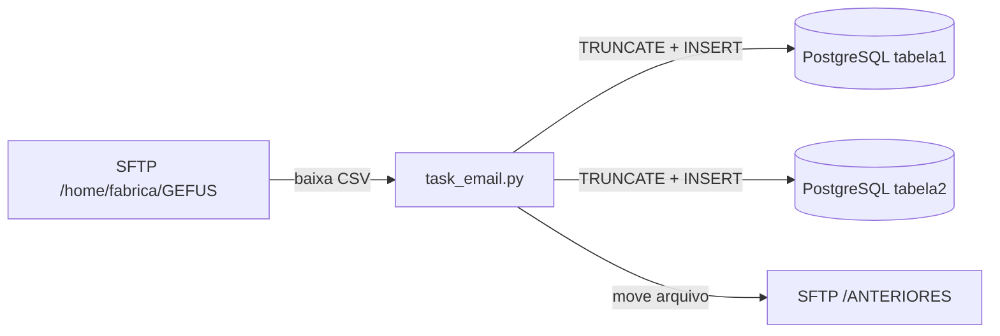

# automacoes-MCID-airflow

Pipeline em Airflow para automação de ingestão de dados do MCID (Ministério das Cidades).
Baixa arquivos CSV de um servidor SFTP, carrega em um banco PostgreSQL em duas camadas
(`tabela1` e `tabela2`) e move os arquivos processados para uma pasta
histórica no SFTP.

## Arquitetura



A DAG `DAG-indicium` em [dags/dag.py](dags/dag.py) executa quatro tasks em sequência
(`task1`, `task2` e `task3` em paralelo no início, e `task_email` no fim) e está agendada
para rodar a cada 2 horas (`0 */2 * * *`).

## Estrutura do projeto

```
automacoes-MCID-airflow/
├── dags/
│   ├── dag.py                  # Definição da DAG e dependências entre tasks
│   └── tasks/
│       └── task_email.py       # Ingestão do CSV semanal MCMV via SFTP
├── requirements.txt
├── docker-compose.yml
└── .env                        # Credenciais e configuração (não versionado)
```

## task_email.py

Responsável por ingerir o arquivo mais recente do padrão
`Arquivo_exemplo.csv`. Fluxo:

1. Conecta no SFTP via `paramiko` e lista os CSVs que casam com `file_prefix`.
2. Escolhe o arquivo mais recente (`max(available_files)` — o sufixo `YYYYMMDD` garante
   que a ordem alfabética é a ordem cronológica).
3. Compara com `SELECT DISTINCT _source_file FROM tabela2.<tabela>`. Se a
   tabela já contém exatamente esse arquivo, encerra.
4. Baixa o CSV para um `BytesIO` e lê com `pandas.read_csv` (separador `;`, encoding
   `utf-8`).
5. Normaliza nomes de colunas (remove acentos, lowercase, troca espaços por `_`).
6. Em uma transação (`engine.begin()`):
   - `TRUNCATE tabela1.<tabela>`
   - `TRUNCATE tabela2.<tabela>`
7. Insere o DataFrame nas duas schemas:
   - `tabela1`: todas as colunas como `VARCHAR(255)`.
   - `tabela2`: tipagem semântica (`Date`, `Float`, `Integer`, `VARCHAR`)
     para colunas conhecidas (`data_de_movimento`, `data_de_contratacao`,
     `valor_contratado`, `uh_contratadas`, etc.).
8. Move o arquivo no SFTP para `SFTP_DIR_ANTERIORES`. Se a movimentação falhar (por
   exemplo, arquivo já existe no destino), apenas loga um `[WARN]` e segue.

## Variáveis de ambiente (`.env`)

| Variável | Descrição |
|---|---|
| `host`, `port`, `database`, `user`, `password` | Conexão PostgreSQL |
| `SFTP_HOST`, `SFTP_PORT`, `SFTP_USER`, `SFTP_PASSWORD` | Conexão SFTP |
| `SFTP_DIR` | Diretório remoto onde os CSVs novos chegam |
| `SFTP_DIR_ANTERIORES` | Diretório remoto para onde os arquivos processados são movidos |
| `file_prefix` | Prefixo do nome do arquivo a ser ingerido |
| `local_dir` | Diretório local de download |
| `TABLE_NAME` | Nome da tabela de destino (mesmo nome nas duas schemas) |
| `BANCO_BRUTOS` | Schema dos dados crus (ex.: `tabela1`) |
| `BANCO_PROCESSADOS` | Schema dos dados tipados (ex.: `tabela2`) |

## Setup

Requisitos: Python 3.10+ e acesso ao SFTP e ao PostgreSQL.

```bash
pip install -r requirements.txt
cp .env.example .env   # crie e preencha o .env
```

Para subir via Docker Compose:

```bash
docker-compose up -d
```

## Execução manual

A task `task_email` pode ser executada fora do Airflow para teste, passando uma data:

```bash
python dags/tasks/task_email.py 2026-05-08
```

Se o argumento for omitido, usa a data/hora local atual.

## Observações

- O script usa `engine.begin()` ao truncar para garantir commit explícito (necessário a
  partir do SQLAlchemy 2.0 — `engine.connect()` sozinho faz rollback ao sair do
  contexto).
- A lógica de deduplicação compara `_source_file` no banco com o último arquivo do
  SFTP: como o `TRUNCATE` zera as tabelas a cada carga, a coluna `_source_file` sempre
  refletirá apenas o último arquivo carregado.
- A task `task_email` é idempotente: se rodar duas vezes com o mesmo arquivo no SFTP,
  a segunda execução detecta que o banco já está carregado e encerra sem trabalho.
